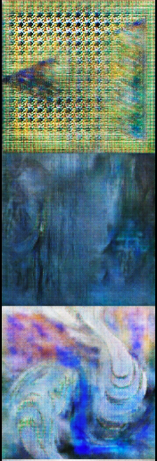
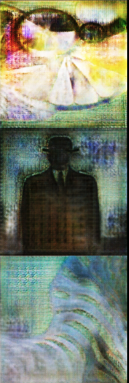
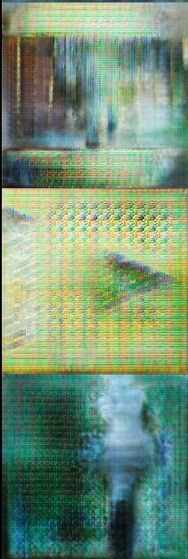
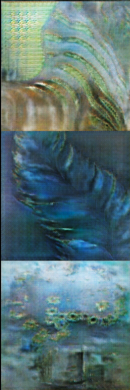
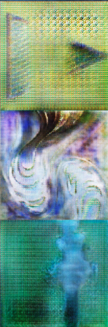
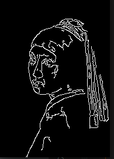

# pix2pix-tensorflow

Fork from the original code [pix2pix-tensorflow](https://github.com/yenchenlin/pix2pix-tensorflow)

We could swap Deconvolution layers with depth2space (also named subpixel convolution) to remove the "checker-board" effect.

# Painting
This repo is looking at the relation between the "hard" inputs (contours) and the "soft" input (noise).
To look at this relation, I'm painting an image from its contours. The noise is a gaussian noise.

# Output
In this table, I show the output depending on the noise distribution.

| Output                                    |  Mean | STD   | Output                                  |  Mean | STD   |
|-------------------------------------------|-------|-------|-----------------------------------------|-------|-------|
|       | 64    |  32   ||16     | 8     |
|   | 8     |  4    | |4      | 2     |
|   | 0     |  1    | |0      | 0     |
Example of the input :

# Requires
- OpenCV
- Tensorflow 1.0
- tqdm

# Dataset
I saved the dataset in this pickle file on [Drive](https://drive.google.com/file/d/0B5Q47jMFaIWSTEhCSWtIWGd2MzQ/view?usp=sharing)
Its structure is : ([painting], [contour]) where the contours are computed using Canny

# TODO
- [x] Add example with differents seed
- [ ] Use differents noise (Uniform, Perlin)

## Acknowledgments
Code borrows heavily from [pix2pix](https://github.com/phillipi/pix2pix) and [DCGAN-tensorflow](https://github.com/carpedm20/DCGAN-tensorflow/blob/master/model.py). Thanks for their excellent work!
