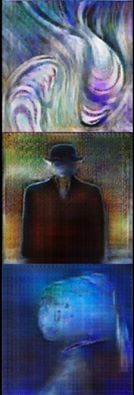

#pix2pix-tensorflow
Fork from the original code [pix2pix-tensorflow](https://github.com/yenchenlin/pix2pix-tensorflow)

#painting
This repo is looking at the relation between the "hard" inputs (contours) and the "soft" input (noise).
To look at this relation, I'm painting an image from its contours.

#output
Example of the output : 
Example of the input : ![example_contours.png]
#requires
-OpenCV
-Tensorflow 1.0
-tqdm

#dataset
I saved the dataset in this pickle file on [Drive](https://drive.google.com/file/d/0B5Q47jMFaIWSTEhCSWtIWGd2MzQ/view?usp=sharing)
Its structure is : ([painting], [contour]) where the contours are computed by Canny

## Acknowledgments
Code borrows heavily from [pix2pix](https://github.com/phillipi/pix2pix) and [DCGAN-tensorflow](https://github.com/carpedm20/DCGAN-tensorflow/blob/master/model.py). Thanks for their excellent work!
